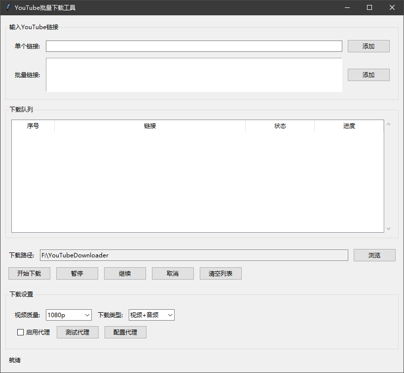

# YouTube批量下载工具



---

YouTube批量下载工具基于[yt-dlp](https://github.com/yt-dlp/yt-dlp)开发，支持批量下载以及高分辨率支持。

## 新功能

- 现在支持下载2K和4K高分辨率视频！
- 自动更新yt-dlp到最新版本，确保与YouTube最新变化兼容

## 使用方法1
1. 运行`main.py`启动程序
2. 输入YouTube视频链接或包含链接的文本文件路径
3. 选择输出目录
4. 选择视频质量（现在支持从360p到4K的多种分辨率）
5. 点击"下载"按钮开始下载

## 使用方法2（推荐）

+ 在[Releases](https://github.com/spacezonebeta/YouTubeDownloader/releases)下载YouTube下载工具.zip，解压后即可使用。

## 注意事项
- 下载高分辨率视频(2K/4K)可能需要较长时间，且文件较大
- 确保您的网络连接稳定，以避免下载中断
- 如果下载失败，程序会自动尝试使用不同的下载方式

## 安装说明

### 前提条件

- Python 3.6 或更高版本
- FFmpeg（用于合并视频和音频）

### 安装步骤

1. 克隆或下载本项目到本地

2. 安装所需依赖包：

```bash
pip install -r requirements.txt
```

3. 安装FFmpeg（用于合并视频和音频）

   - Windows用户：
     - 下载FFmpeg：https://ffmpeg.org/download.html
     - 将FFmpeg添加到系统环境变量PATH中

   - macOS用户：
     ```bash
     brew install ffmpeg
     ```

   - Linux用户：
     ```bash
     sudo apt update
     sudo apt install ffmpeg
     ```

## 使用说明

1. 运行程序：

```bash
python main.py
```

2. 在程序界面中：
   - 输入单个YouTube链接或批量输入多个链接
   - 选择下载质量和类型
   - 设置下载路径
   - 点击"开始下载"按钮开始下载

3. 下载管理：
   - 可以暂停、继续或取消正在进行的下载
   - 可以清空下载列表
   - 下载进度和状态实时显示

## 注意事项

- 请确保您有合法权利下载视频内容
- 高质量视频下载需要更多的带宽和存储空间
- 某些视频可能因版权限制无法下载
- 合并视频和音频需要FFmpeg支持

## 许可证

本项目采用MIT许可证。详情请参阅LICENSE文件。